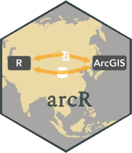

<!-- README.md is generated from README.Rmd. Please edit that file -->

# arcR 

<!-- badges: start -->

[](https://CRAN.R-project.org/package=arcR)
[](https://spatlyu.r-universe.dev/arcR)
<!-- badges: end -->

The goal of **arcR** is to integrate the benefits of *R* and *ArcGIS*
with using *ArcGIS* in *R*.

## Installation

You can install the development version of *arcR* from
[GitHub](https://github.com/SpatLyu/arcR) with:

``` r
# install.packages("devtools")
devtools::install_github("SpatLyu/arcR",build_vignettes = T,dep = T)
```

## Example
